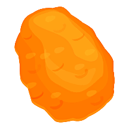

# Open Source Clicking Game

This is an open source clicking game app being developed with Flutter. The app will have scoreboards, boosts, leaderboards, and other features common to clicking games.

## Status

The app is currently in the development stage and not yet released. Development is expected to take 2-3 months. Contributions are now accepted and feature requests are welcome.

<<<<<<< HEAD
=======
<<<<<<< HEAD
>>>>>>> 0d8a2ac (All changes listed in CHANGELOG.md)

  
  
  -blue?style=for-the-badge&)
  
  
  
  

<<<<<<< HEAD
=======
=======

-blue?style=for-the-badge&)

>>>>>>> parent of 3ed67a5 (Update README.md)
>>>>>>> 0d8a2ac (All changes listed in CHANGELOG.md)

## Features

- Scoreboards
- Boosts
- Leaderboards

## Feature Requests

If you have any ideas or suggestions for features you'd like to see in the app, please open an issue with the label "feature request". Your request will be reviewed and considered for inclusion in the app.

## License

This app is released under the terms of the GNU General Public License v3.0. You can find a copy of the license in the [LICENSE](LICENSE) file.

# How to Build the App

- Clone the repository to your local machine.
- Make sure you have the Flutter SDK installed and added to your PATH.
- Open the project in your preferred IDE (such as Android Studio or VS Code).
- Run ``flutter pub get`` to install the required dependencies.
- Run ``flutter run`` to launch the app on your connected device or emulator.

- You will also have to configure Firebase for any authentication.

NOTE: Steps to build the app may be different for you depending on the type of machine you are running on.

